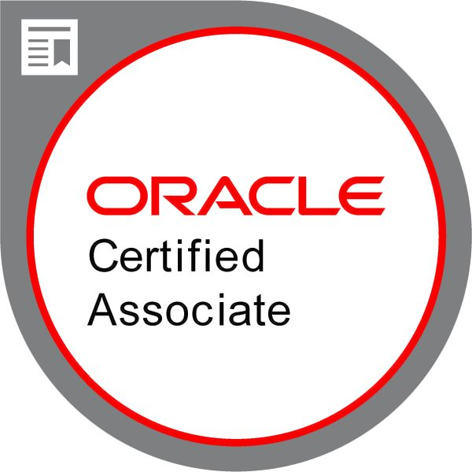
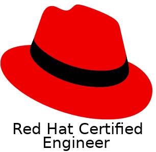
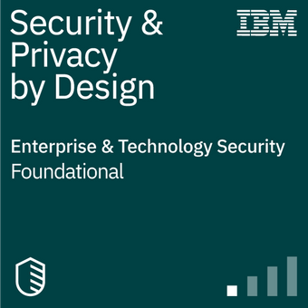
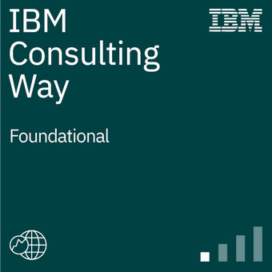

<!--- <abbr title="click here for the most recent résumé. For more details on the specific area, click on the below hyperlinks.">[&uarr;&uarr; latest résumé | https://Rajkumar-Aute.github.io/Rajkumar-Aute ](https://Rajkumar-Aute.github.io/Rajkumar-Aute/){:target="_blank"}</abbr> (Looking for job in Hyderabad, on Cloud based Kubernetes, EKS) --->
Catch up  [9945571886](https://wa.me/+919945571886){:target="_blank"} ~
 [RajkumarAute@gmail.com](mailto:RajkumarAute@gmail.com){:target="_blank"} ~
 [Bangalore](https://en.wikipedia.org/wiki/Bangalore){:target="_blank"}

> Technophile since childhood, started my career in 2012 as IT engineer. And in 2017 switched to _Cloud and DevOps technology_ as _AWS Cloud Architect, Kubernetes, Terraform, Cloud DevSecOps Engineer._ Proficient in Design, Implementation and Delivery of Websites & Applications.

### Bag of Tricks (Skills)
> ___DevOps Tools___ > Kubernetes, EKS, AKS, Docker, Terraform, Git, Azure DevOps, Monitoring.  
___AWS  & Microsoft Azure___ > Cloud Compute, Storage, Network & other services such as EC2, ECS, EKS, RDS, S3, VPC, CDN, Redis, Route53 & other cloud services.  
___Other skills___ > Linux, Windows, basic bash scripting, Ansible, Firewalls, LVMs, Database servers, virtualization, VMWare EXSi, XenServer, ITSM, Agile, Scrum.

### Go the extra mile (Experience)
###  [International Business Machines](https://www.ibm.com){:target="_blank"} _**Application Developer, Cloud DevSecOps | Bangalore.**_ May 2022 - Present
> **Client - Shell India**  
Build and automate Azure Kubernetes Service infra for Data analytics platform.  
AKS Cluster setup using Terraform and Azure DevOps.

###  [Tata Consultancy Services](http://www.tcs.com){:target="_blank"} _**IT Analyst | Lead Cloud Architect & DevOps | Bangalore.**_ Dec 2020 - May 2022  
> Lead for Application migration to AWS cloud using Terraform and Azure DevOps.  
Lead Cloud Architect and Handled AWS L2 production issues. & Contributed to build CI/CD pipeline, Git, Kubernetes & Terraform.

###  [DevDigital Vadodara](http://www.devdigital.com){:target="_blank"} *** Server Administrator | Cloud Architect & DevOps | WFH.*** May 2020 - Nov 2020.  
> Designed & built the AWS & Azure Cloud infra & Addressed AWS L3 issues & security concerns as well as Azure L1.  
Contributed to Built & automate the Kubernetes, AWS EKS, ECS, & Docker used to build & migrate containerized applications. & CI/CD pipeline using  Jenkins, buddy.works, Git & Terraform used to build cloud infra.

###  [Lera Technologies](http://www.lera.us){:target="_blank"} _**Senior System Administrator | Cloud Architect | Hyderabad.**_ Sep 2019 - Apr 2020.  
> Designed and built cloud infra and Addressed AWS L2 & Azure L1 production issues.  
Contributed to Built & automate CI/CD pipeline, Git & Jenkins used to build a containerized application, virtualization, O365, & Oracle JD Edwards ERP.

###  [Wonderla Holidays Ltd.](http://www.wonderla.com){:target="_blank"} ***Executive IT | AWS, Linux | Hyderabad.*** Aug 2018 - Aug 2019
> Administrated the Cloud infra & Accomplished various Cloud Services  
Achieved 98% service uptime for Billing application & Websites on Linux & DB servers hosted in VMWare ESXi & AWS cloud.

###  [3i Infotech](http://www.3i-infotech.com){:target="_blank"} *** <!---Engineer | AWS, Linux | Hyderabad.--->***  <!---Mar 2015 - Jul 2018 ---> |  [Info Services](http://ibmesp.com){:target="_blank"}<!---*** Support Engineer | Windows,Network | Clients-MAFIL*** Aug 2014 - Mar 2015.  ---> |  [Kaizen IT Services](https://www.linkedin.com/company/kaizen-it-services-pvt.-ltd./){:target="_blank"} *** Engineer*** Mar 2012 - <!---Mar 2012 - July 2014---> Jul 2018    
> Handled Linux & DB servers on Cloud. ADDC, Users & Groups, File & Print Sharing.  
Handled Windows DC Servers, Routers, Switches, Users & Groups.

### Learning curve (Certifications)
>  [**Certified Kubernetes Administrator (CKA)**](https://www.credly.com/){:target="_blank"} ~ Dec 2022(Scheduled)  
 [**AWS Certified Solutions Architect – Associate**](https://www.credly.com/badges/950ba75b-a8e7-4439-836f-d376c0427560?source=linked_in_profile){:target="_blank"} ~ Oct 2019 - Oct 2022  
 [**Microsoft Certified Azure Administrator Associate**](https://www.credly.com/badges/0ca6c8a7-e631-4a79-8270-bc94404d1705?source=linked_in_profile){:target="_blank"} ~ Jan 2021 - Jan 2023  
 [**Oracle Cloud Infrastructure Foundations Certified**](https://www.credly.com/badges/93d0e186-5352-44bb-9d57-8400d5dd14aa?source=linked_in_profile){:target="_blank"} ~ Apr 2020 - Oct 2021  
 [**Red Hat Certified Engineer**](https://rhtapps.redhat.com/verify?certId=180-084-022){:target="_blank"} ~ Jul 2018 - Jul 2021  

>  [**IBM DevSecOps Essentials**](https://www.credly.com/badges/e19cb742-c05c-40d8-9d2e-979a92a4fedb/public_url){:target="_blank"}  
 [**IBM Security and Privacy by Design Foundations**](https://www.credly.com/badges/9d566f46-fdc4-4c49-ab6b-270e54da0768/public_url){:target="_blank"}  
 [**IBM Garage Essentials**](https://www.credly.com/badges/07bcd366-73cc-48a3-be98-d7be94a50c73/public_url){:target="_blank"}  
 [**IBM Garage Foundation**](https://www.credly.com/badges/32e585fc-aa8f-4113-95f4-e520f5e7d0bf/public_url){:target="_blank"}  
 [**IBM Agile Explorer**](https://www.credly.com/badges/c3e6edb8-0874-4a87-8013-b8858b78f153/public_url){:target="_blank"}  
 [**IBM Enterprise Design Thinking Practitioner**](https://www.credly.com/badges/9f172c65-e442-43be-b2cb-d07f22c28395/public_url){:target="_blank"}  
 [**IBM Consulting Way**](https://www.credly.com/badges/22a02dc8-4977-4212-866a-4ad290c72438/public_url){:target="_blank"}  

### By the book (Education)
>**PGDCA [Gulbarga University](https://www.gug.ac.in/){:target="_blank"}** with 62.16% in 2016  
**Bachelor of Commerce [Gulbarga University](https://www.gug.ac.in/){:target="_blank"}** with 69.84% in 2013  
**[Karnataka PUE Board Bangalore](https://pue.karnataka.gov.in){:target="_blank"} 10+2** with 49% in 2009  
**[Karnataka Sec Edu Board](https://sslc.karnataka.gov.in/){:target="_blank"} 10th / SSLC** with 47.84% in 2005

#### Win-Win (Honors & Awards)
> [TCS](http://www.tcs.com) Achieved [__TCS Gems, Contextual Master__](https://www.tcs.com/tcs-way/contextual-knowledge-mastery-tcs-client-growth){:target="_blank"} Award for sharing my Cloud DevOps knowledge & contributing to the client project.  
[WHL](http://www.wonderla.com) Appreciated by the VP IT for implementing automation.  
[3i Infotech](http://www.3i-infotech.com) Appreciated by the clients for implementing best practices in IT service.  
National Level Gold Medal in rifle shooting, NCC Thal Sainik Computation Camp Delhi-2005.

##### More About me - résumé [https://Rajkumar-Aute.github.io/Rajkumar-Aute](https://Rajkumar-Aute.github.io/Rajkumar-Aute/){:target="_blank"} | [linkedin](https://www.linkedin.com/in/RajkumarAute/){:target="_blank"} | [GitHub](https://github.com/Rajkumar-Aute){:target="_blank"}