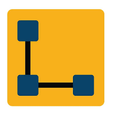
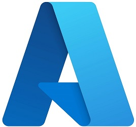
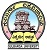
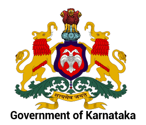

<abbr title="click here for the most recent résumé. For more details on the specific area, click on the below hyperlinks.">[&uarr;&uarr; latest résumé | https://Rajkumar-Aute.github.io/Rajkumar-Aute ](https://Rajkumar-Aute.github.io/Rajkumar-Aute/){:target="_blank"}</abbr> (Looking for job in Hyderabad, on Kubernetes on cloud, AWS EKS, Azure DevOps AKS)
\
 [9945571886](https://wa.me/+919945571886){:target="_blank"} ~
 [RajkumarAute@gmail.com](mailto:RajkumarAute@gmail.com){:target="_blank"} ~
 [Hyderabad (WFH-Gulbarga)](){:target="_blank"}
\
[/Rajkumar-Aute](https://github.com/Rajkumar-Aute){:target="_blank"} ~ [/RajkumarAute](https://www.linkedin.com/in/RajkumarAute/){:target="_blank"} ~  [Rajkumar-Aute.tk](http://rajkumar-aute.tk){:target="_blank"}
<!--- ~ [/RajkumarAute](https://rajkumaraute.blogspot.com/){:target="_blank"}
-->

> With 9+ years' experience in the IT industry, including 4+ years in ***Amazon Web Services Cloud Computing, Kubernetes, Terraform, DevOps*** and a background in the design, implementation, and delivery of websites and applications. **Job aspiration Kubernetes - Cloud based (AWS-EKS, Azure-AKS)**

## Skills 
> ___DevOps Tools___ > Kubernetes, EKS, AKS, Docker, Terraform, Git, Jenkins, Azure DevOps, Monitoring  
___AWS  & Microsoft Azure___ > Cloud Compute, Storage, Network & other services such as EC2, ECS, EKS, RDS, S3, VPC, CDN, Redis, Route53, AKS.  
___Other skills___ > Linux, Windows, Ansible, Firewalls, LVMs, Database servers, virtualization, VMWare EXSi, XenServer, ITSM, Agile.

## Experience
###  [Tata Consultancy Services](http://www.tcs.com){:target="_blank"} _**IT Analyst | Cloud DevOps | Bangalore.**_ Dec 2020 - Present  
> Leading the team, application migration to AWS cloud using Terraform and Azure DevOps.  
Addressed L2 production issues on AWS cloud infra. & Contrubuted to build CI/CD entironment using Azure DevOps, EKS, AKS, Git & Terraform. 

###  [DevDigital Vadodara](http://www.devdigital.com){:target="_blank"} *** Server Administrator | Lead Cloud DevOps Architect | WFH.*** May 2020 - Nov 2020.  
> Addressed AWS L3 production issues & security concerns as well as Azure L1.  
Kubernetes, AWS EKS, ECS, & Docker are used to build & migrate containerized applications.  
Contributed to Built & automate the CI/CD pipeline using Azure DevOps, Jenkins, buddy.works, Git & Terraform is used to build cloud infrastructure.

###  [Lera Technologies](http://www.lera.us){:target="_blank"} _**Senior System Administrator | Cloud DevOps | Hyderabad.**_ 3 Sep 2019 - 20 Apr 2020.  
> Designed & built the AWS & Azure Cloud infrastructure for Production, as well as taking care of L2 production issues.  
Git & Jenkins are used to build a CI/CD pipeline for automating deployment of the containerized application.  
Supported Server virtualization, O365, & Oracle JD Edwards ERP.

###  [Wonderla Holidays Ltd.](http://www.wonderla.com){:target="_blank"} ***Executive IT | AWS, Linux | Hyderabad.*** Aug 2018 - Aug 2019
> Administrated the Cloud infra & Accomplished various Cloud Services  
Achieved 98% service uptime for Billing application & Websites on Linux & DB servers hosted in VMWare ESXi & AWS cloud.

###  [3i Infotech Consultancy Services](http://www.3i-infotech.com){:target="_blank"} ***System Engineer | AWS, Linux | Hyderabad.*** Mar 2015 - Jul 2017 & Oct 2017 - Jul 2018
> Handled Linux servers & DB servers on AWS Cloud. ADDC, Users & Groups, File & Print Sharing. 

###  [Info Services](http://ibmesp.com){:target="_blank"} ***Support Engineer | Windows,Network - Admin.*** Aug 2014 - Mar 2015.   
###  [Kaizen IT Services](https://www.linkedin.com/company/kaizen-it-services-pvt.-ltd./){:target="_blank"} ***Support Engineer | Windows,Network - Admin.*** Mar 2012 - July 2014    
> Handled DC Servers, Routers, Switches, Network applications, Users & Groups. 

## Certifications
>  [**AWS Certified Solutions Architect – Associate**](https://www.credly.com/badges/950ba75b-a8e7-4439-836f-d376c0427560?source=linked_in_profile){:target="_blank"} ~ Oct 2019 - Oct 2022  
 [**Microsoft Certified Azure Administrator Associate**](https://www.credly.com/badges/0ca6c8a7-e631-4a79-8270-bc94404d1705?source=linked_in_profile){:target="_blank"} ~ Jan 2021 - Jan 2023  
 [**Oracle Cloud Infrastructure Foundations Certified**](https://www.credly.com/badges/93d0e186-5352-44bb-9d57-8400d5dd14aa?source=linked_in_profile){:target="_blank"} ~ Apr 2020 - Oct 2021  
 [**Red Hat Certified Engineer**](https://rhtapps.redhat.com/verify?certId=180-084-022){:target="_blank"} ~ Jul 2018 - Jul 2021  

## Education
>  **Bachelor of Commerce** _[Gulbarga University](https://www.gug.ac.in/){:target="_blank"}_ with 69.84% in 2013  
 **[Karnataka PUE Board Bangalore](http://pue.kar.nic.in/){:target="_blank"} 10+2** with 49% in 2009  
 **[Karnataka Sec Edu Board](https://sslc.karnataka.gov.in/){:target="_blank"} 10th / SSLC** with 47.84% in 2005
<!--  **Post Graduation Diploma in Computer Application** _[Gulbarga University](https://www.gug.ac.in/){:target="_blank"}_ with 62.16% in 2016 -->

#### Honors & Awards
> [TCS](http://www.tcs.com) Achieved [__Contextual Master__](https://www.tcs.com/tcs-way/contextual-knowledge-mastery-tcs-client-growth){:target="_blank"} Award for sharing my Cloud DevOps knowledge & contributing to the client project.  
[WHL.](http://www.wonderla.com) Appreciated by the VP for implementing DevOps tools to automate the CI/CD process to save time & effort.  
[3i Infotech](http://www.3i-infotech.com) Appreciated by the clients for implementing best practises in IT service.  
National Level Gold Medal in rifle shooting, NCC Thal Sainik Computation Camp Delhi-2005.
